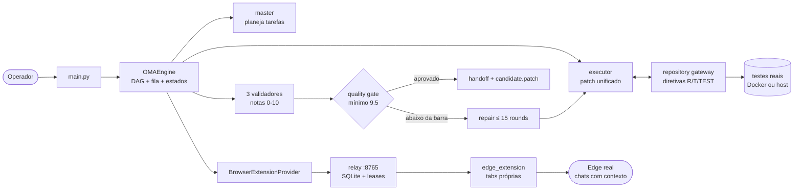
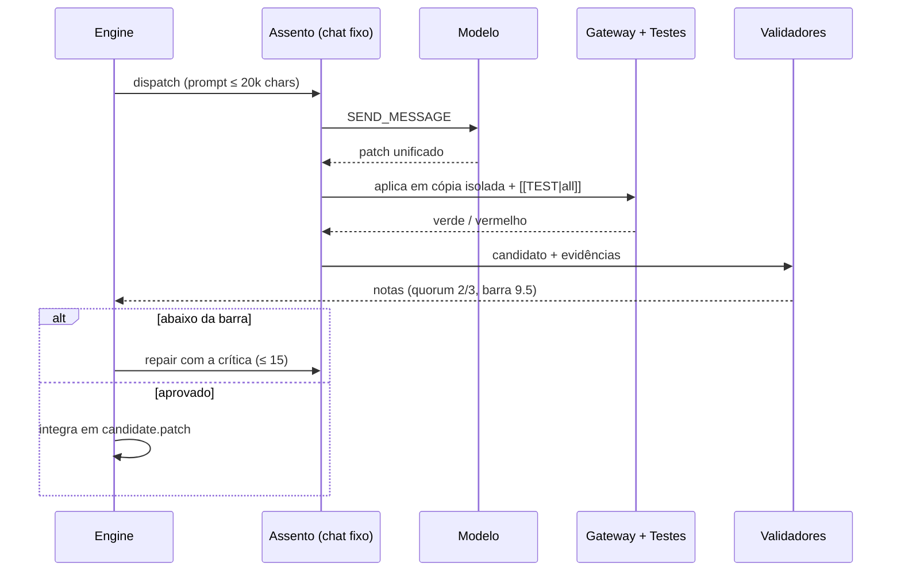

# SENTRA


**Orquestração auditável de implementação de código com agentes de IA.**
LLMs propõem; software verifica as evidências e controla o fluxo.
Consenso entre modelos não é prova de correção — teste verde + quorum é.

> Leia também: [`skills/oma_operator/SKILL.md`](skills/oma_operator/SKILL.md)
> (runbook do operador) · [`docs/traps.md`](docs/traps.md) (armadilhas reais) ·
> [`docs/OMA_Orquestrador_Multiagente.md`](docs/OMA_Orquestrador_Multiagente.md)
> (especificação).

---

## Como funciona



Cada tarefa do DAG percorre o ciclo:



Regras que o código impõe (não são sugestões): 5 assentos fixos por run
(master, executor, 3 validadores) com reutilização de chat e cooldown de 30s;
teto de 20000 caracteres por mensagem; reparo anti-estagnação;
**sem replay de envio incerto** (reconciliação explícita do operador);
**sem promoção automática** — aplicar no original é ` --promote` manual.

---

## Passo a passo

### 0. Pré-requisitos

Windows 10/11, Python 3.11+, Microsoft Edge com login no site de chat
(modo não-privado), ~4GB livres. Docker Desktop opcional (validação em
container). Aviso: automatizar UI de chat pode violar Termos do serviço;
o provedor conta **chats criados** no rate limit.

### 1. Instalar

```powershell
cd <pasta-do-SENTRA>
python --version            # 3.11+
python -m pip install -r requirements.txt
```

### 2. Fumaça offline (sem Edge, sem custo)

```powershell
python -B main.py --demo
```

Modelos roteirizados + testes reais em `.oma/demo-*`. Prova a máquina local,
não inteligência nem Edge.

### 3. Caminho live: relay + extensão

```powershell
# Terminal 1 (deixe aberto)
python -B main.py --relay   # anote o token em .oma/relay-token
```

No Edge logado: `edge://extensions` → modo desenvolvedor →
**Carregar sem compactação** → pasta `edge_extension/` → Detalhes →
Opções → cole o token → **Ativar** → salve. A extensão cria 2 tabs próprias
e fala com `http://127.0.0.1:8765`. Recarregue-a após qualquer update.
Um relay por porta (sonde `/health` antes — dual-bind = 2 filas invisíveis).

### 4. Doctor (diagnóstico, zero custo)

```powershell
python -B main.py --doctor   # relay + token + workers_online TAB-*
```

Prova de fogo (cria **1 conversa real**):

```powershell
$env:OMA_LIVE_EXTENSION = '1'
python -B -m pytest tests/e2e/test_extension_live.py -s
```

### 5. Console de acompanhamento

```powershell
Start-Process python -ArgumentList '-B','dashboard/server.py','--port','8899' `
  -WorkingDirectory '<pasta-do-SENTRA>'
# http://127.0.0.1:8899/  (só leitura: overview, runs, conversas, falhas, resumos)
```

### 6. Primeira missão (pequena de propósito)

```powershell
python -B main.py --job-id primeira-run --workspace '<pasta-do-projeto>' `
  --provider extension --reviewer extension --workers 1 `
  --prompt 'Corrigir a função X preservando a API e adicionar testes de borda' `
  --trust-workspace
```

Cada tarefa = 1 fatia completa (código + teste), **≤ ~250 linhas por
entrega** (teto de 20k). Missões gigantes de uma vez falham por mecânica;
projetos grandes nascem do **acúmulo de runs** (baseline + patches + fila
persistente `MASTER_QUEUE`).

### 7. Resultado e promoção

```powershell
python -B main.py --status --workspace '<pasta-do-projeto>' --job-id primeira-run
python -B main.py --promote primeira-run --workspace '<pasta-do-projeto>'  # manual!
```

Leia `handoff.md` + `candidate.patch` antes. `--resume` retoma (mesmo
backend/política); `--reconcile` + `--drop-seat` resolve assento travado
sem replay. Códigos de saída: `0` pronto/aplicado · `1` falhou ·
`2` config inválida · `130` cancelado.

Sem Edge? `--provider local --reviewer local` com Ollama/vLLM
(`local_model` no `config.yaml`). `--demo` nunca representa live.

### 8. Operação contínua (programas, não só runs)

```powershell
python -B main.py --supervise --workspace '<pasta-do-projeto>' --idle-exit-secs 300
```

O supervisor mastiga a fila sozinho (backoff após falhas, watchdog por
`events.jsonl` parado, sentinelas `runs/SUPERVISOR.pause|.stop`). Falha isola
o galho (status `PARTIAL`); transitório retenta com backoff sem gastar repair;
`<workspace>/memory/` acumula ADRs e lições entre runs; `provides/requires`
entre tarefas aborta cedo em violação. O console tem a visão **Programa**
(velocidade, taxonomia de falhas, flakiness) e o push roda CI no Windows.

---

## Console (dashboard)

| Visão | Mostra |
|---|---|
| Visão geral | Cards (runs, projetos, failed, chats quebrados) + tabela por projeto |
| Runs | Status, tarefas x/y, detalhe de chats com link da conversa real |
| Conversas | Todos os chats, filtro por estado |
| Falhas | Assentos NOT_SENT/UNCERTAIN/BLOCKED, entregas FAILED, tarefas FAILED |
| Resumos | Markdown de contexto **gerado localmente** (objetivo, tarefas, chats+URLs, validações, falhas, eventos), por projeto ou run, com copiar/baixar |

APIs: `/api/overview` · `/api/conversations?state=` · `/api/failures` ·
`/api/summary?run_id=|project=` · `/api/responses` · `/api/relay/jobs`.
Só GET, só loopback, stdlib, SQLite em `mode=ro`. Um dashboard por porta.

---

## Configuração essencial (`config.yaml`)

| Chave | Efeito |
|---|---|
| `routing.worker / reviewer` | `extension` (live), `local`, `openai`; sem fallback implícito |
| `oma.max_seats: 5` | Teto de **criação de chats**: master + executor + 3 validadores |
| `oma.min_release_score: 9.5` | Barra de release (0–10) |
| `oma.max_repair_rounds: 15` | Reparos por tarefa; `stagnation_limit: 5` escala |
| `oma.inter_call_delay_s: 30.0` | Cooldown entre mensagens reais |
| `validation.commands` | `["[[TEST|all]]"]`; `profiles` = argv locais do operador |
| `--workers / --max-rounds` | Concorrência de tarefas (1–8) / teto de tentativas |

---

## Testes

```powershell
python -B -m pytest tests -q            # suíte (unit + integration + failure + load)
python -B -m pytest tests/unit -q       # bloco rápido
$env:OMA_DOCKER_TESTS = '1'             # + containers reais (opt-in)
```

`pytest.ini` limita a coleta a `tests/` (runs, `.oma`, `Auxiliares` e perfis
de browser ficam de fora). Doubles de teste só injetam **falha** no código
real — nunca provam integração; prova live = URL de conversa + versões
casadas + `workers_online`.

---

## Estrutura

| Área | Responsabilidade |
|---|---|
| `main.py`, `orchestrator/configuration.py` | CLI, diagnóstico, roteamento explícito |
| `orchestrator/runtime.py` | Snapshot, retomada, handoff, promoção externa |
| `orchestrator/engine.py`, `queue.py`, `state_machine.py` | DAG, fila, estados |
| `orchestrator/agents/` | Planner, executor, críticos, reparo, revisor |
| `orchestrator/verification.py`, `quality_gate.py` | Testes no candidato, critérios |
| `orchestrator/conversation_pool.py` | 5 assentos fixos, pacing, reconciliação |
| `orchestrator/providers/`, `browser/` | Adaptadores + pool de tabs reais |
| `native_bridge/` | Relay autenticado, protocolo, SQLite |
| `edge_extension/` | MV3: tabs próprias, envio, leitura (só primitivas) |
| `repository/`, `workspace/` | Gateway de diretivas, patches, snapshots, sandbox |
| `dashboard/` | Console somente-leitura |
| `self_improvement/`, `research/` | Ciclo de melhoria, verificadores de apoio |
| `skills/oma_operator/` | Runbook do operador · `skills/sentra_repo/` gateway local |


