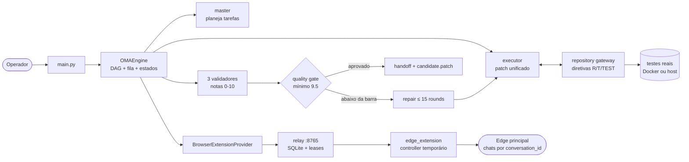
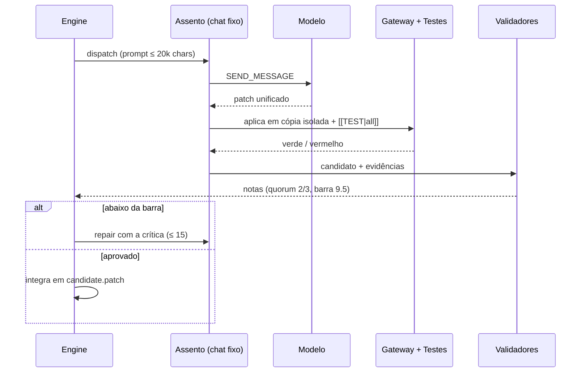

# SENTRA


**Orquestração auditável de implementação de código com agentes de IA.**
LLMs propõem; software verifica as evidências e controla o fluxo.
Consenso entre modelos não é prova de correção — teste verde + quorum é.

> Leia também: [`skills/oma_operator/SKILL.md`](skills/oma_operator/SKILL.md)
> (runbook do operador) · [`docs/traps.md`](docs/traps.md) (armadilhas reais) ·
> [`docs/OMA_Orquestrador_Multiagente.md`](docs/OMA_Orquestrador_Multiagente.md)
> (especificação).

## SENTRA Desktop v1

O caminho recomendado para usuários Windows é o **SENTRA Desktop**. Releases
estáveis publicam um Setup `.exe` e um MSI per-user, ambos Authenticode-signed,
além de SHA-256, CycloneDX SBOM e pacote de atualização verificável.

A aplicação fornece tray + painel operacional para MCP, Secure Tunnel, Edge,
Docker, Git e Remote Agent; profiles Safe/Developer/Full; workspaces com
permissões read/write/execute; jobs/fila OMA; auditoria, diff, snapshots e
rollback; Quick Start do Secure MCP Tunnel sem PowerShell.

**Novo por aqui? Comece em [`docs/ZERO_CONFIG_SETUP.md`](docs/ZERO_CONFIG_SETUP.md).** Instale e use os recursos locais imediatamente; OpenAI, Codex, Edge, Git e Docker são integrações opcionais e configuráveis sob demanda. Veja também [`docs/START_HERE.md`](docs/START_HERE.md). O guia mostra Desktop, terminal, ChatGPT/MCP, Codex/Web Models, Edge e Maestri sem misturar os papéis.\n\nQuick Start: [`docs/QUICKSTART.md`](docs/QUICKSTART.md). Arquitetura:
[`docs/ARCHITECTURE.md`](docs/ARCHITECTURE.md). Segurança:
[`SECURITY.md`](SECURITY.md). Processo de publicação:
[`docs/RELEASE.md`](docs/RELEASE.md).

O fluxo CLI abaixo continua suportado para desenvolvimento do próprio SENTRA.

## Comece aqui: escolha como quer usar o SENTRA

Você não precisa configurar tudo para começar. Escolha **uma** superfície, valide que ela funciona e só depois habilite as demais.

**Primeiros passos recomendados:**

1. Instale/abra o SENTRA e confirme **MCP Ready**.
2. Se quiser usar o ChatGPT como cliente das tools locais, conecte o **Secure MCP Tunnel**.
3. Se quiser usar ChatGPT/Gemini Web dentro do Codex, abra **Web Models** e conecte o Codex ao Gateway local.
4. Instale a extensão **Edge** apenas quando quiser que o SENTRA opere uma aba web já aberta.

| Superfície | Use quando | Primeiro passo |
|---|---|---|
| **SENTRA Desktop** | instalar, conectar OpenAI, configurar política, Edge/Web Models e acompanhar saúde | abra o Desktop e conclua **Quick Start** |
| **Terminal / SENTRA CLI** | conversar com um agente no terminal, executar tools e coordenar Maestri | `sentra-cli.cmd` no checkout ou `sentra-cli.exe` instalado |
| **Codex + Web Models** | disponibilizar modelos ChatGPT/Gemini Web dentro do Codex e do OMA | **Web Models → Abrir interface Web → Conectar Codex** |
| **ChatGPT app/plugin via Secure MCP Tunnel** | deixar o ChatGPT chamar o MCP local do SENTRA sem publicar a porta 8000 | **Quick Start → Connect OpenAI & Start**, depois conecte o app MCP no ChatGPT |

### Modelo mental em 30 segundos

- Quer **usar o SENTRA diretamente**? Abra o **Desktop** ou `sentra-cli` no terminal.
- Quer **usar ChatGPT/Gemini Web como modelos dentro do Codex/OMA**? Ative **Web Models**; o Codex fala com o Gateway local do SENTRA.
- Quer que **o próprio ChatGPT chame tools do SENTRA**? Conecte o **Secure MCP Tunnel** e adicione o SENTRA como app/plugin MCP no ChatGPT.
- Quer que o SENTRA **opere uma aba web já aberta**? Habilite a **extensão Edge**. Ela é um atuador de navegador, não o caminho MCP.

Esses caminhos podem coexistir. Tunnel não substitui Web Models; Web Models não substitui a extensão; a extensão não expõe o MCP ao ChatGPT.

O **Secure MCP Tunnel** e a **extensão Edge** resolvem problemas diferentes. O tunnel conecta o ChatGPT ao **MCP local** do SENTRA por uma conexão HTTPS de saída. A extensão Edge é o **atuador de navegador**: quando uma tarefa realmente precisa do ChatGPT/Gemini Web, ela adota temporariamente uma aba elegível já aberta no Edge principal.

O Quick Start atual pareia o relay local da extensão automaticamente; não copie bearer tokens para a extensão.

Guia unificado: [`docs/USING_SENTRA.md`](docs/USING_SENTRA.md). Guias por superfície: [`docs/QUICKSTART.md`](docs/QUICKSTART.md) · [`docs/SENTRA_CLI.md`](docs/SENTRA_CLI.md) · [`docs/WEB_MODELS.md`](docs/WEB_MODELS.md) · [`docs/SECURE_MCP_TUNNEL.md`](docs/SECURE_MCP_TUNNEL.md).

---

## Como funciona


```mermaid
flowchart LR
    OP([Operador]) --> CLI[main.py]
    CLI --> ENG[OMAEngine<br/>DAG + fila + estados]
    ENG --> PLN[master<br/>planeja tarefas]
    ENG --> EXE[executor<br/>patch unificado]
    ENG --> VAL[3 validadores<br/>notas 0-10]
    EXE <--> GW[repository gateway<br/>diretivas R/T/TEST]
    GW --> TST[(testes reais<br/>Docker ou host)]
    VAL --> QG{quality gate<br/>mínimo 9.5}
    QG -->|abaixo da barra| REP[repair ≤ 15 rounds]
    REP --> EXE
    QG -->|aprovado| HO[handoff + candidate.patch]
    ENG --> PROV[BrowserExtensionProvider]
    PROV --> REL[relay :8765<br/>SQLite + leases]
    REL --> EXT[edge_extension<br/>controller temporário]
    EXT --> EDGE([Edge principal<br/>chats por conversation_id])
```

Cada tarefa do DAG percorre o ciclo:


```mermaid
sequenceDiagram
    participant E as Engine
    participant S as Assento (chat fixo)
    participant M as Modelo
    participant G as Gateway + Testes
    participant V as Validadores
    E->>S: dispatch (prompt ≤ 20k chars)
    S->>M: SEND_MESSAGE
    M-->>S: patch unificado
    S->>G: aplica em cópia isolada + [[TEST|all]]
    G-->>S: verde / vermelho
    S->>V: candidato + evidências
    V-->>E: notas (quorum 2/3, barra 9.5)
    alt abaixo da barra
        E->>S: repair com a crítica (≤ 15)
    else aprovado
        E->>E: integra em candidate.patch
    end
```

Regras que o código impõe (não são sugestões): 5 assentos fixos por run
(master, executor, 3 validadores) com reutilização de chat e cooldown de 30s;
teto de 20000 caracteres por mensagem; reparo anti-estagnação;
**sem replay de envio incerto** (reconciliação explícita do operador);
**sem promoção automática** — aplicar no original é ` --promote` manual.

---

## Passo a passo

### 0. Pré-requisitos

Windows 10/11, Python 3.11+, Microsoft Edge com login no site de chat
(modo não-privado), ~4GB livres. Docker Desktop opcional (validação em
container). Aviso: automatizar UI de chat pode violar Termos do serviço;
o provedor conta **chats criados** no rate limit.

### 1. Instalar

```powershell
cd <pasta-do-SENTRA>
python --version            # 3.11+
python -m pip install -r requirements.txt
```

### 2. Fumaça offline (sem Edge, sem custo)

```powershell
python -B main.py --demo
```

Modelos roteirizados + testes reais em `.oma/demo-*`. Prova a máquina local,
não inteligência nem Edge.

### 3. Caminho live legado para desenvolvimento do OMA\n\n> **Fluxo de source checkout.** No produto instalado, use **SENTRA Desktop → Quick Start → Open Edge extensions**. O pareamento atual é gerenciado pelo SENTRA; não copie bearer/relay token manualmente.

```powershell
# Terminal 1 (deixe aberto)
python -B main.py --relay   # somente fluxo legado/source checkout
```

No **Edge principal já logado**: `edge://extensions` → modo desenvolvedor →
**Carregar sem compactação** → pasta `edge_extension/` → Detalhes →
No fluxo legado, conclua o pareamento conforme o relay de desenvolvimento. No produto instalado, o SENTRA cuida dessa etapa. Não é necessário abrir outro
perfil/navegador. A extensão mantém **zero tabs próprias sempre** e, sob demanda, adota
temporariamente **no máximo 1 aba `chatgpt.com` já existente e inativa**. Research inicia chats em série,
guarda seus `conversation_id` e coleta as respostas depois por ID, portanto
paralelismo lógico não exige uma tab por subagente. Recarregue a extensão após
qualquer update. Um relay por porta (sonde `/health` antes — dual-bind = 2 filas invisíveis).

### 4. Doctor (diagnóstico, zero custo)

```powershell
python -B main.py --doctor   # relay + token + workers_online TAB-*
```

Prova de fogo (cria **1 conversa real**):

```powershell
$env:OMA_LIVE_EXTENSION = '1'
python -B -m pytest tests/e2e/test_extension_live.py -s
```

### 5. Console de acompanhamento

```powershell
Start-Process python -ArgumentList '-B','dashboard/server.py','--port','8899' `
  -WorkingDirectory '<pasta-do-SENTRA>'
# http://127.0.0.1:8899/  (só leitura: overview, runs, conversas, falhas, resumos)
```

### 6. Primeira missão (pequena de propósito)

```powershell
python -B main.py --job-id primeira-run --workspace '<pasta-do-projeto>' `
  --provider extension --reviewer extension --workers 1 `
  --prompt 'Corrigir a função X preservando a API e adicionar testes de borda' `
  --trust-workspace
```

Cada tarefa = 1 fatia completa (código + teste), **≤ ~250 linhas por
entrega** (teto de 20k). Missões gigantes de uma vez falham por mecânica;
projetos grandes nascem do **acúmulo de runs** (baseline + patches + fila
persistente `MASTER_QUEUE`).

### 7. Resultado e promoção

```powershell
python -B main.py --status --workspace '<pasta-do-projeto>' --job-id primeira-run
python -B main.py --promote primeira-run --workspace '<pasta-do-projeto>'  # manual!
```

Leia `handoff.md` + `candidate.patch` antes. `--resume` retoma (mesmo
backend/política); `--reconcile` + `--drop-seat` resolve assento travado
sem replay. Códigos de saída: `0` pronto/aplicado · `1` falhou ·
`2` config inválida · `130` cancelado.

Sem Edge? `--provider local --reviewer local` com Ollama/vLLM
(`local_model` no `config.yaml`). `--demo` nunca representa live.

### 8. Operação contínua (programas, não só runs)

```powershell
python -B main.py --supervise --workspace '<pasta-do-projeto>' --idle-exit-secs 300
```

O supervisor mastiga a fila sozinho (backoff após falhas, watchdog por
`events.jsonl` parado, sentinelas `runs/SUPERVISOR.pause|.stop`). Falha isola
o galho (status `PARTIAL`); transitório retenta com backoff sem gastar repair;
`<workspace>/memory/` acumula ADRs e lições entre runs; `provides/requires`
entre tarefas aborta cedo em violação. O console tem a visão **Programa**
(velocidade, taxonomia de falhas, flakiness) e o push roda CI no Windows.

---

## Console (dashboard)

| Visão | Mostra |
|---|---|
| Visão geral | Cards (runs, projetos, failed, chats quebrados) + tabela por projeto |
| Runs | Status, tarefas x/y, detalhe de chats com link da conversa real |
| Conversas | Todos os chats, filtro por estado |
| Falhas | Assentos NOT_SENT/UNCERTAIN/BLOCKED, entregas FAILED, tarefas FAILED |
| Resumos | Markdown de contexto **gerado localmente** (objetivo, tarefas, chats+URLs, validações, falhas, eventos), por projeto ou run, com copiar/baixar |

APIs: `/api/overview` · `/api/conversations?state=` · `/api/failures` ·
`/api/summary?run_id=|project=` · `/api/responses` · `/api/relay/jobs`.
Só GET, só loopback, stdlib, SQLite em `mode=ro`. Um dashboard por porta.

---

## Configuração essencial (`config.yaml`)

| Chave | Efeito |
|---|---|
| `routing.worker / reviewer` | `extension` (live), `local`, `openai`; sem fallback implícito |
| `oma.max_seats: 5` | Teto de **criação de chats**: master + executor + 3 validadores |
| `oma.min_release_score: 9.5` | Barra de release (0–10) |
| `oma.max_repair_rounds: 15` | Reparos por tarefa; `stagnation_limit: 5` escala |
| `oma.inter_call_delay_s: 30.0` | Cooldown entre mensagens reais |
| `validation.commands` | `["[[TEST|all]]"]`; `profiles` = argv locais do operador |
| `--workers / --max-rounds` | Concorrência de tarefas (1–8) / teto de tentativas |

---

## SENTRA MCP

O SENTRA também pode operar como servidor **MCP v2** para clientes compatíveis.
Por padrão ele usa `stdio`; opcionalmente, `streamable-http` fica restrito a
`127.0.0.1`.

```powershell
python -m pip install -r requirements.txt
python -B -m sentra_mcp
# ou:
python -B -m sentra_mcp --transport streamable-http --host 127.0.0.1 --port 8000
```

A superfície padrão é `core + developer + browser`; OMA/remote/admin são
opt-in. Ela inclui filesystem/workspaces com permissões, processos Docker
persistentes, repository gateway, jobs assíncronos, documentos estruturados,
browser Edge/Playwright e research single/parallel/MCTS-inspired. Em `chatgpt.com`,
o modo `auto` exige o bridge do Edge principal e nunca abre/faz fallback para um
perfil separado sem login/plano. Em HTTP MCP
2026-07-28, `sentra_session_open` cria a sessão opaca usada para isolar IDs
persistentes entre conversas. O default de processo é `workspace` em Docker e
falha fechado se o isolamento não estiver disponível. O MCP não expõe promoção
automática: `CANDIDATE_READY != APPLIED`.

Execuções longas usam Runs/Operations duráveis com idempotência, checkpoints, eventos append-only, reconciliation baseada em evidência, leases/fencing, process tree e recovery por `sentra.exe run resume <run_id>`. Agent e Chat têm identidades separadas, portanto uma conversa física pode ser substituída sem apagar a missão. Contrato operacional: `docs/DURABLE_EXECUTION.md`.

Guia completo: `docs/MCP_SERVER.md` · configuração do **Secure MCP Tunnel**
e da Runtime API key sem expor credenciais: `docs/SECURE_MCP_TUNNEL.md` · auditoria
comparativa: `docs/MCP_AUDIT.md`.

### SENTRA Commander v1

A camada Commander transforma o MCP local em um produto multi-device:

```text
ChatGPT / Claude / Codex
          │ OAuth/OIDC
          ▼
   SENTRA Cloud MCP
          │
          ▼
     SENTRA Relay
          │ outbound only
   ┌──────┼────────┐
   ▼      ▼        ▼
  PC   notebook  servidor
          │
          ▼
  SENTRA Remote Agent
          │
          └─ MCP local + filesystem + terminal + Git + OMA + browser + sandbox
```

O Cloud MCP expõe apenas device management e chamadas remotas; filesystem,
terminal e browser continuam executando no agente local sob `allowed_roots`, ACL
por device/tool, tokens rotacionáveis/revogáveis e leases que viram `UNCERTAIN`
em vez de replay automático quando uma execução pode ter começado.

Documentação: `docs/COMMANDER_V1.md` · deploy: `docs/DEPLOYMENT.md` · privacidade:
`docs/PRIVACY.md` · threat model: `docs/THREAT_MODEL.md`.

---

## Testes

```powershell
python -B -m pytest tests -q            # suíte (unit + integration + failure + load)
python -B -m pytest tests/unit -q       # bloco rápido
$env:OMA_DOCKER_TESTS = '1'             # + containers reais (opt-in)
```

`pytest.ini` limita a coleta a `tests/` (runs, `.oma`, `Auxiliares` e perfis
de browser ficam de fora). Doubles de teste só injetam **falha** no código
real — nunca provam integração; prova live = URL de conversa + versões
casadas + `workers_online`.

---

## Estrutura

| Área | Responsabilidade |
|---|---|
| `main.py`, `orchestrator/configuration.py` | CLI, diagnóstico, roteamento explícito |
| `orchestrator/runtime.py` | Snapshot, retomada, handoff, promoção externa |
| `orchestrator/engine.py`, `queue.py`, `state_machine.py` | DAG, fila, estados |
| `orchestrator/agents/` | Planner, executor, críticos, reparo, revisor |
| `orchestrator/verification.py`, `quality_gate.py` | Testes no candidato, critérios |
| `orchestrator/conversation_pool.py` | 5 assentos fixos, pacing, reconciliação |
| `orchestrator/providers/`, `browser/` | Adaptadores + browser/controller por conversation_id |
| `native_bridge/` | Relay autenticado, protocolo, SQLite |
| `edge_extension/` | MV3: controller temporário, envio/coleta por conversation_id, recovery de UI |
| `repository/`, `workspace/` | Gateway de diretivas, patches, snapshots, sandbox |
| `dashboard/` | Console somente-leitura |
| `self_improvement/`, `research/` | Ciclo de melhoria, verificadores de apoio |
| `skills/oma_operator/` | Runbook do operador · `skills/sentra_repo/` gateway local |


