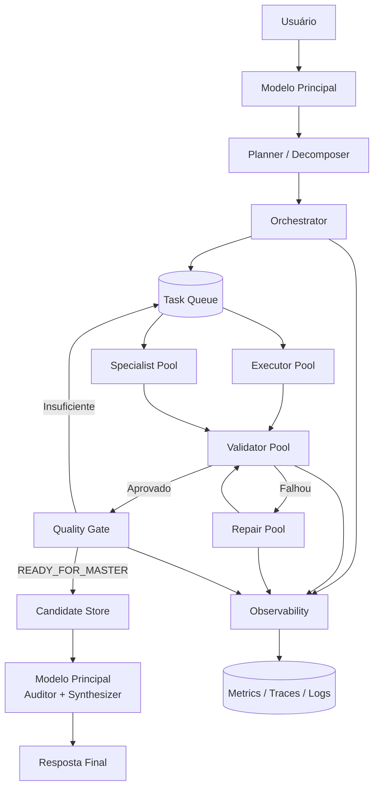
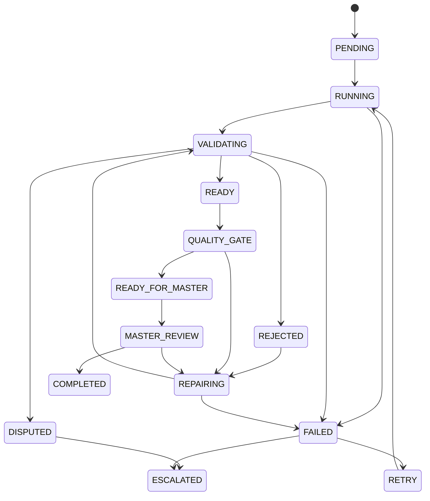
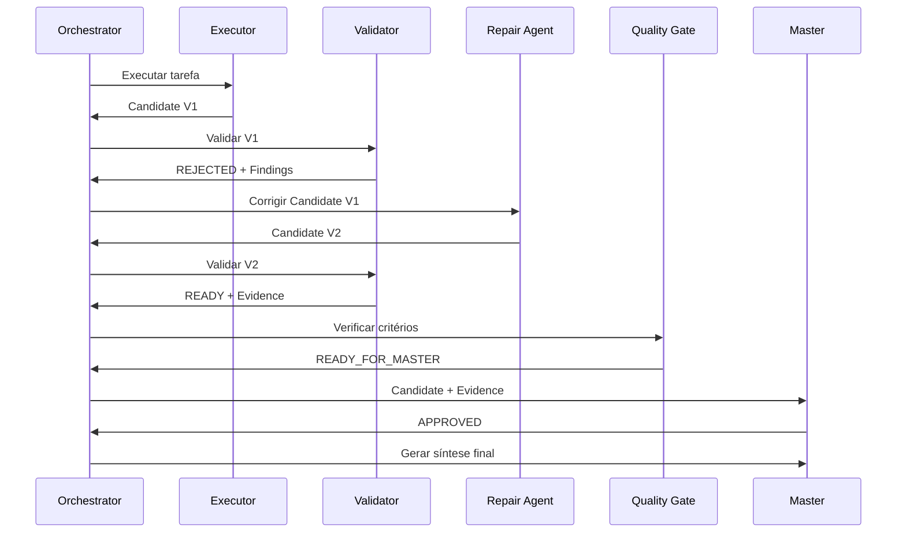
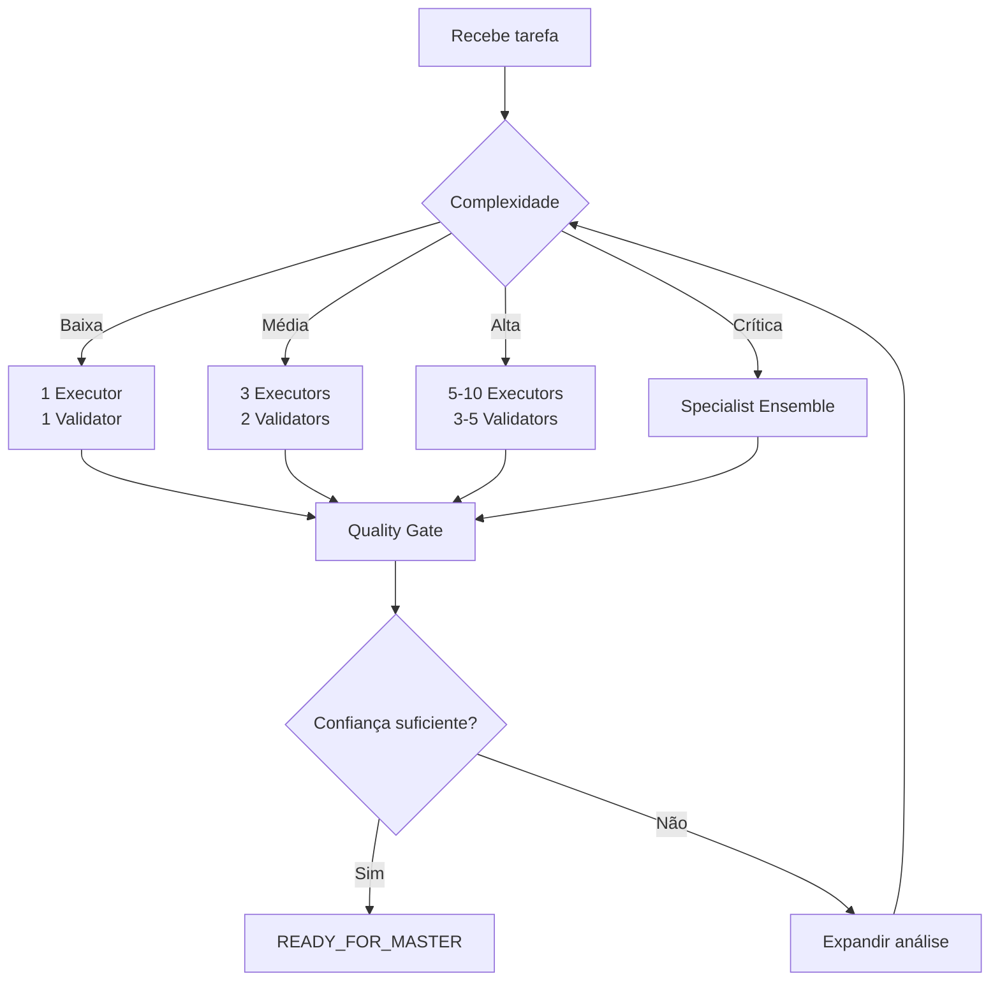
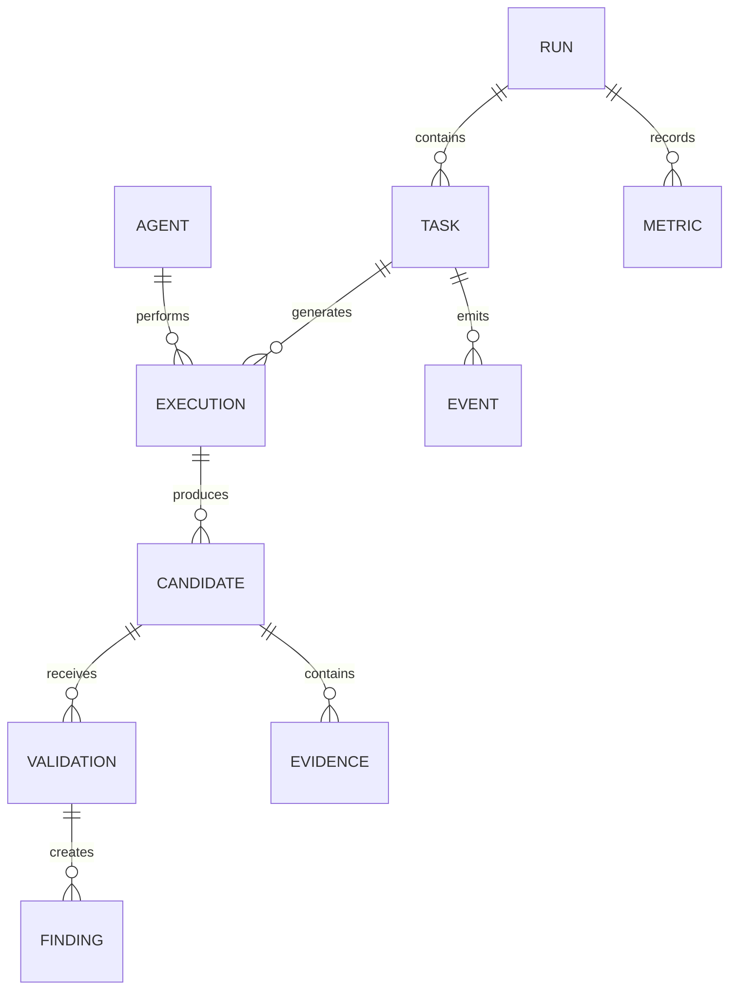
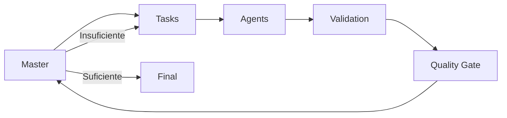
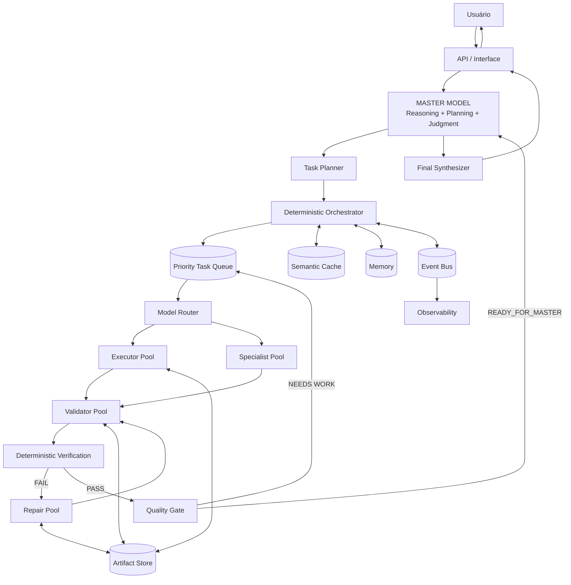

# OMA — Orquestrador Multiagente com Validação Iterativa

**Versão:** 1.0  
**Categoria:** Plataforma de Orquestração de Inteligência Artificial  
**Arquitetura:** Multiagente, orientada a eventos, com validação iterativa  
**Objetivo principal:** Maximizar qualidade e confiabilidade enquanto minimiza o uso do modelo de maior custo computacional.

---

## 1. Visão Geral

O **OMA — Orquestrador Multiagente** é uma arquitetura de inteligência composta na qual um modelo de maior capacidade atua prioritariamente como:

- planejador;
- decompositor de problemas;
- orquestrador;
- árbitro;
- auditor;
- sintetizador final.

A execução intensiva é delegada a uma camada de modelos secundários, que podem assumir papéis especializados como:

- Executor;
- Validador;
- Crítico;
- Reparador;
- Verificador;
- Especialista;
- Juiz intermediário.

O princípio central é:

> **Usar inteligência premium para decidir e julgar, e computação abundante para executar, testar e refinar.**

Em vez de consumir continuamente o modelo mais forte durante todo o raciocínio, o OMA cria ciclos independentes de execução e validação.

O modelo principal volta a ser acionado quando uma subtarefa alcança um estado formal de maturidade, como `READY_FOR_MASTER`.

---

# 2. Objetivos do Produto

O sistema deve maximizar simultaneamente:

1. qualidade das respostas;
2. confiabilidade;
3. rastreabilidade;
4. eficiência de recursos;
5. escalabilidade;
6. tolerância a falhas;
7. independência entre agentes;
8. capacidade de revisão;
9. controle de custos;
10. reutilização de resultados;
11. observabilidade;
12. interoperabilidade entre diferentes modelos.

---

# 3. Princípio Arquitetural

Uma execução tradicional utiliza aproximadamente:

```text
USUÁRIO
   ↓
MODELO FORTE
   ↓
RACIOCÍNIO
   ↓
EXECUÇÃO
   ↓
REVISÃO
   ↓
RESPOSTA
```

No OMA:

```text
USUÁRIO
   ↓
MODELO PRINCIPAL
   ↓
PLANEJAMENTO
   ↓
ORQUESTRADOR
   ↓
AGENTES SECUNDÁRIOS
   ↓
EXECUÇÃO ↔ VALIDAÇÃO ↔ CORREÇÃO
   ↓
READY_FOR_MASTER
   ↓
MODELO PRINCIPAL
   ↓
AUDITORIA + SÍNTESE
   ↓
RESPOSTA FINAL
```

O modelo principal deixa de ser responsável por todo o trabalho bruto.

---

# 4. Arquitetura de Alto Nível



---

# 5. Componentes Principais

## 5.1 Master Model

Modelo de maior capacidade disponível.

### Responsabilidades

- compreender a intenção original;
- definir objetivos;
- decompor problemas;
- identificar dependências;
- escolher estratégias;
- atribuir prioridades;
- selecionar especializações;
- definir critérios de sucesso;
- definir orçamento de execução;
- avaliar candidatos finais;
- resolver conflitos entre validadores;
- sintetizar a resposta definitiva.

O Master Model deve evitar executar tarefas triviais que possam ser delegadas.

---

## 5.2 Planner

Responsável por transformar um problema amplo em um grafo de execução.

Exemplo:

```text
Objetivo

├── Tarefa A
│   ├── A1
│   ├── A2
│   └── A3
│
├── Tarefa B
│   ├── B1
│   └── B2
│
└── Tarefa C
```

Cada tarefa deve conter:

```yaml
task_id: T-001
objective: ""
description: ""
dependencies: []
priority: HIGH
risk: MEDIUM
required_capabilities: []
validation_strategy: ""
max_iterations: 4
token_budget: 12000
status: PENDING
```

---

# 6. Task Orchestrator

O **Task Orchestrator** é o núcleo determinístico do sistema.

Decisões críticas de fluxo não devem depender exclusivamente de texto produzido por modelos.

Responsabilidades:

- gerenciamento da fila;
- prioridades;
- dependências;
- timeouts;
- retries;
- distribuição;
- cancelamento;
- quotas;
- estados;
- backpressure;
- controle de concorrência;
- circuit breaker;
- recuperação de falhas;
- escalonamento para o Master Model.

---

# 7. Máquina de Estados

Cada tarefa deve possuir um estado formal.



---

# 8. Estados Padronizados

Estados mínimos:

```text
PENDING
QUEUED
RUNNING
VALIDATING
REJECTED
REPAIRING
READY
DISPUTED
QUALITY_GATE
READY_FOR_MASTER
MASTER_REVIEW
COMPLETED
FAILED
RETRYING
CANCELLED
ESCALATED
```

O sistema nunca deve inferir estado apenas analisando uma frase livre como:

> "Acredito que esteja pronto."

O agente deve retornar uma estrutura formal.

---

# 9. Contrato de Saída do Agente

Formato conceitual:

```json
{
  "task_id": "T-1042",
  "status": "READY",
  "confidence": 0.94,
  "summary": "Implementação validada.",
  "requirements_checked": [
    "RF-01",
    "RF-02",
    "RNF-04"
  ],
  "tests": [
    {
      "name": "unit_test_auth",
      "status": "PASS"
    }
  ],
  "issues": [],
  "remaining_risks": [],
  "evidence": [],
  "recommended_action": "PROMOTE"
}
```

---

# 10. Quality Gate

Uma mensagem `READY` produzida pelo modelo **não significa automaticamente que a tarefa está pronta**.

Existe uma camada independente chamada:

# Quality Gate

Ela avalia critérios objetivos.

Exemplo:

```text
READY do Executor
        +
READY do Validador Lógico
        +
READY do Validador de Requisitos
        +
Testes objetivos
        +
Nenhum erro crítico
        ↓
READY_FOR_MASTER
```

---

# 11. Quorum de Validação

É recomendável trabalhar com quorum.

Exemplo:

```yaml
validators_required: 3
minimum_approvals: 2
critical_rejection_blocks: true
objective_test_required: true
```

Para tarefas críticas:

```yaml
validators_required: 5
minimum_approvals: 4
security_validator_required: true
requirements_validator_required: true
objective_test_required: true
```

---

# 12. Diversidade de Validadores

Usar dez cópias idênticas do mesmo agente não representa dez validações independentes.

O sistema deve procurar **diversidade cognitiva**.

## Validator — Logic

Procura:

- inconsistências;
- contradições;
- erros algorítmicos;
- premissas incorretas.

## Validator — Requirements

Pergunta:

> A solução realmente atende ao que foi solicitado?

## Validator — Adversarial

Procura deliberadamente maneiras de quebrar a solução.

## Validator — Edge Cases

Analisa:

- valores nulos;
- entradas inesperadas;
- condições extremas;
- concorrência;
- estados incompletos.

## Validator — Security

Analisa:

- autenticação;
- autorização;
- exposição de dados;
- injections;
- privilégios;
- isolamento.

## Validator — Performance

Analisa:

- complexidade;
- memória;
- latência;
- paralelismo;
- gargalos;
- escalabilidade.

---

# 13. Ciclo Executor → Validador → Reparador



---

# 14. Limite de Iterações

Loops ilimitados são proibidos.

Exemplo:

```text
MAX_REPAIR_ROUNDS = 4
MAX_VALIDATION_ROUNDS = 5
MAX_ESCALATIONS = 2
```

Após exceder o limite:

```text
STATUS = DISPUTED
```

ou:

```text
STATUS = ESCALATED
```

O Master Model recebe então o problema.

---

# 15. Critério de Parada

O sistema deve parar quando o benefício marginal esperado de outra rodada for menor que seu custo.

Conceitualmente:

```text
ExpectedImprovement < ExecutionCost
        ↓
       STOP
```

Também pode utilizar:

```text
confidence >= threshold
AND
critical_findings == 0
AND
required_tests == PASS
AND
requirements_coverage >= threshold
```

---

# 16. Confidence não deve ser autorreferencial

Um modelo declarar:

```text
confidence = 0.99
```

não é evidência suficiente.

A confiança final pode ser calculada pelo Orchestrator:

```text
FinalConfidence =
    ValidatorAgreement
  × TestPassRate
  × RequirementsCoverage
  × EvidenceQuality
  × HistoricalAgentReliability
```

Exemplo:

```text
ValidatorAgreement          0.95
TestPassRate                1.00
RequirementsCoverage        0.98
EvidenceQuality             0.93
HistoricalReliability       0.91
```

A pontuação pode ser normalizada posteriormente.

---

# 17. Arquitetura de Pools

Não é necessário manter centenas de agentes permanentemente ativos.

Utilizar **pools lógicos**.

```text
ExecutorPool
ValidatorPool
RepairPool
ExpertPool
JudgePool
```

O tamanho deve ser dinâmico.

Exemplo:

```text
Problema simples
2 agentes

Problema intermediário
4–8 agentes

Problema complexo
10–30 agentes

Problema crítico
expansão adaptativa
```

---

# 18. Escalonamento Adaptativo

O número de agentes deve depender da dificuldade.



---

# 19. Progressive Computation

Um dos princípios fundamentais do OMA deve ser:

> **Não gastar 100 unidades de computação quando 5 são suficientes.**

Estratégia:

```text
1 agente
   ↓
confiança baixa?

+2 agentes
   ↓
ainda baixa?

+5 validadores
   ↓
ainda controverso?

especialistas
   ↓
Master
```

Isso é preferível a disparar 200 consultas indiscriminadamente.

---

# 20. Hierarquia Recomendada

Uma topologia eficiente pode ser:

```text
                    MASTER
                      │
                  PLANNER
                      │
               ORCHESTRATOR
                      │
          ┌───────────┴───────────┐
          │                       │
      EXECUTORS               SPECIALISTS
          │                       │
          └───────────┬───────────┘
                      │
                  VALIDATORS
                      │
                   REPAIR
                      │
                  VALIDATORS
                      │
                QUALITY GATE
                      │
                CANDIDATE POOL
                      │
                 META-JUDGE
                      │
                    MASTER
                      │
                  FINAL OUTPUT
```

---

# 21. Compressão de Contexto

Um dos mecanismos mais importantes para economizar tokens do Master Model é evitar enviar todo o histórico dos agentes.

Não enviar:

```text
50.000 tokens de conversas intermediárias
```

Enviar:

```text
Original Task
Final Candidate
Important Decisions
Tests
Evidence
Rejected Alternatives
Known Risks
Unresolved Questions
```

---

# 22. Candidate Package

Formato recomendado:

```yaml
candidate_id: C-2081

task:
  id: T-031
  objective: ""

solution:
  content: ""

validation:
  validators: 5
  approvals: 5
  rejections: 0

tests:
  total: 18
  passed: 18
  failed: 0

requirements:
  coverage: 1.00

iterations:
  execution: 1
  repair: 2
  validation: 3

risks:
  critical: []
  remaining: []

evidence:
  - id: E-01
  - id: E-02

status: READY_FOR_MASTER
```

---

# 23. Economia de Tokens

O objetivo não é necessariamente minimizar:

```text
TotalTokens
```

e sim minimizar:

```text
PremiumModelTokens
```

mantendo ou aumentando qualidade.

Exemplo hipotético:

| Estratégia | Tokens modelo forte | Tokens secundários |
|---|---:|---:|
| Forte executando tudo | 100.000 | 0 |
| Delegação básica | 40.000 | 100.000 |
| OMA | 20.000 | 250.000 |
| OMA otimizado | 10.000 | 300.000 |

Economia do modelo principal:

```text
100.000 → 10.000

≈ 90%
```

Embora o consumo agregado possa aumentar.

---

# 24. Função Objetivo

A otimização real pode ser definida como:

```text
maximize:

Quality × Reliability × Evidence

─────────────────────────────────

PremiumCompute × Latency × Cost
```

Ou:

\[
Utility =
\frac
{Quality \times Confidence \times Reliability}
{PremiumTokens \times Cost \times Latency}
\]

---

# 25. Requirements

## 25.1 Requisitos Funcionais

### RF-001 — Recepção de tarefas

O sistema deve receber uma solicitação e transformá-la em uma execução rastreável.

### RF-002 — Planejamento

O sistema deve permitir decomposição em subtarefas.

### RF-003 — Dependências

Tarefas devem poder depender de outras tarefas.

### RF-004 — Priorização

Cada tarefa deve possuir prioridade.

### RF-005 — Distribuição

O sistema deve selecionar agentes adequados a cada tarefa.

### RF-006 — Execução

Executores devem produzir candidatos.

### RF-007 — Validação

Candidatos devem poder passar por múltiplos validadores.

### RF-008 — Reparação

Falhas identificadas devem gerar tarefas de reparação.

### RF-009 — Iteração

O sistema deve suportar ciclos controlados de:

```text
Execute → Validate → Repair
```

### RF-010 — Quality Gate

O sistema deve possuir critérios formais para promoção de candidatos.

### RF-011 — Escalonamento

Problemas não resolvidos devem poder ser enviados ao Master Model.

### RF-012 — READY formal

O estado `READY_FOR_MASTER` deve ser determinado pelo sistema e não exclusivamente por um LLM.

### RF-013 — Histórico

Todas as transições devem ser registradas.

### RF-014 — Evidências

Cada validação deve poder anexar evidências.

### RF-015 — Retry

Falhas temporárias devem possuir política configurável de retry.

### RF-016 — Timeout

Toda execução deve possuir timeout.

### RF-017 — Cancelamento

Tarefas devem ser canceláveis.

### RF-018 — Budget

Cada tarefa deve poder receber orçamento máximo.

### RF-019 — Model Routing

O sistema deve poder utilizar diferentes modelos.

### RF-020 — Resultado final

O Master Model deve sintetizar os candidatos aprovados.

---

# 26. Requisitos Não Funcionais

## RNF-001 — Escalabilidade

O sistema deve suportar crescimento horizontal dos workers.

## RNF-002 — Resiliência

Falha de um agente não pode interromper toda a execução.

## RNF-003 — Observabilidade

Toda execução deve gerar métricas, logs e traces.

## RNF-004 — Auditabilidade

Deve ser possível reconstruir por que uma resposta foi produzida.

## RNF-005 — Modularidade

Novos modelos devem ser adicionáveis através de adapters.

## RNF-006 — Portabilidade

A arquitetura não deve depender estruturalmente de um único provedor.

## RNF-007 — Segurança

Credenciais devem ser isoladas da camada de prompts.

## RNF-008 — Privacidade

Dados sensíveis devem possuir políticas específicas de armazenamento e transmissão.

## RNF-009 — Determinismo estrutural

Estados e regras críticas devem ser controlados por software convencional.

## RNF-010 — Idempotência

Retries não devem duplicar operações irreversíveis.

## RNF-011 — Extensibilidade

Novos tipos de agentes devem poder ser incorporados.

## RNF-012 — Eficiência

O sistema deve evitar processamento redundante.

---

# 27. Event-Driven Architecture

O sistema deve preferencialmente operar por eventos.

Exemplos:

```text
TASK_CREATED
TASK_STARTED
CANDIDATE_CREATED

VALIDATION_REQUESTED
VALIDATION_COMPLETED

CANDIDATE_REJECTED
REPAIR_REQUESTED

QUALITY_GATE_PASSED

READY_FOR_MASTER

MASTER_REVIEW_STARTED
MASTER_REVIEW_COMPLETED

TASK_COMPLETED
TASK_FAILED
```

---

# 28. Event Envelope

```json
{
  "event_id": "evt_019281",
  "event_type": "VALIDATION_COMPLETED",
  "timestamp": "ISO-8601",
  "correlation_id": "run_842",
  "task_id": "T-104",
  "candidate_id": "C-27",
  "producer": "validator.logic.3",
  "payload": {}
}
```

---

# 29. Correlation ID

Toda execução iniciada pelo usuário deve receber:

```text
run_id
```

Exemplo:

```text
RUN-20260910-000421
```

Todas as tarefas derivadas devem carregar esse identificador.

Isso permite distributed tracing.

---

# 30. Persistência

Entidades mínimas:

```text
Run
Task
Agent
Execution
Candidate
Validation
Finding
Evidence
Event
Metric
Artifact
PromptVersion
ModelProfile
```

Relacionamento conceitual:



---

# 31. Agent Adapter

Modelos não devem ser chamados diretamente pelo domínio.

Criar uma abstração:

```text
AgentProvider
```

Exemplo conceitual:

```java
interface AgentProvider {

    AgentResult execute(
        AgentRequest request
    );

}
```

Implementações:

```text
OpenAIProvider
LocalModelProvider
CloudProvider
BrowserProvider
CustomProvider
```

A integração deve respeitar as APIs, políticas e permissões disponibilizadas pelo provedor utilizado.

---

# 32. Model Router

O Model Router decide qual modelo usar considerando:

```text
complexidade
custo
latência
capacidade
context window
disponibilidade
taxa histórica de sucesso
especialidade
```

Exemplo:

```text
IF complexity == LOW
    → cheap_model

IF complexity == MEDIUM
    → secondary_model

IF complexity == HIGH
    → secondary_model + validators

IF disagreement == HIGH
    → master_model
```

---

# 33. Agent Reliability Score

Cada agente pode possuir histórico.

Exemplo:

```text
AgentReliability =
    ValidationSuccessRate
  × TestSuccessRate
  × HistoricalAccuracy
  × Stability
```

O Orchestrator pode utilizar esse valor para roteamento futuro.

---

# 34. Evitando Consenso Falso

Problema:

```text
10 agentes iguais
+
mesma informação
+
mesmo erro
=
10 votos errados
```

Portanto, quantidade de votos não é suficiente.

Utilizar:

```text
Agent diversity
Model diversity
Prompt diversity
Role diversity
Independent evidence
Deterministic tests
```

---

# 35. Ferramentas Determinísticas

Quando possível:

> **Substituir opinião de modelo por verificação objetiva.**

Para código:

```text
Compiler
Unit Tests
Integration Tests
Static Analysis
Type Checker
Benchmark
Security Scanner
```

Para matemática:

```text
CAS
numerical verification
symbolic verification
property testing
```

Para informações factuais:

```text
source retrieval
cross-reference
date validation
citation validation
```

---

# 36. Observability

O sistema deve suportar os três pilares clássicos:

## Logs

Exemplo:

```text
2026-09-10T17:30:14
run=R892
task=T17
agent=validator.logic
event=VALIDATION_FAILED
```

## Metrics

Exemplos:

```text
tasks_total
tasks_completed
tasks_failed

validation_pass_rate

repair_rounds

tokens_master
tokens_secondary

cost_master
cost_secondary

latency_p50
latency_p95
latency_p99

ready_rate

escalation_rate
```

## Distributed Tracing

```text
UserRequest
   ↓
Planner
   ↓
Task 1
   ↓
Executor
   ↓
Validator
   ↓
Repair
   ↓
Validator
   ↓
Master
```

---

# 37. KPIs Principais

| KPI | Objetivo |
|---|---:|
| Master Token Reduction | > 70% |
| Validation Success | > 90% |
| Automatic Recovery | > 95% |
| Critical Errors Final | próximo de 0 |
| Traceability | 100% |
| Task Completion | > 95% |
| Duplicate Work | < 5% |
| Escalation Rate | controlado |
| Requirements Coverage | > 95% |
| Test Pass Rate em READY | 100% quando aplicável |

---

# 38. Token Accounting

Cada execução deve registrar:

```json
{
  "input_tokens": 1240,
  "output_tokens": 910,
  "reasoning_tokens": 0,
  "cached_tokens": 700,
  "model": "secondary-model",
  "estimated_cost": 0.0
}
```

Mesmo quando um provedor possuir uso praticamente ilimitado, medir tokens continua sendo útil para avaliar eficiência.

---

# 39. Token Budget

Exemplo:

```yaml
run_budget:
  premium_tokens: 40000
  secondary_tokens: 500000

task_budget:
  max_iterations: 4
  max_agents: 8
  max_tokens: 30000
```

---

# 40. Context Budget

Contexto deve ser tratado como recurso.

O agente deve receber somente:

```text
objetivo
dados necessários
restrições
dependências relevantes
resultado anterior necessário
```

Não enviar automaticamente o histórico completo da execução.

---

# 41. Memory Architecture

Separar:

```text
Working Memory
Task Memory
Run Memory
Long-Term Memory
Knowledge Base
Artifact Store
```

## Working Memory

Contexto imediato do agente.

## Task Memory

Histórico daquela subtarefa.

## Run Memory

Conhecimento compartilhado durante aquela execução.

## Long-Term Memory

Informações persistentes úteis em execuções futuras.

---

# 42. Artifact Store

Grandes resultados não devem trafegar continuamente através dos prompts.

Salvar:

```text
código
documentos
datasets
logs
imagens
relatórios
testes
benchmarks
```

e transmitir referências.

---

# 43. Deduplicação

Antes de executar uma nova tarefa:

```text
Existe tarefa semanticamente equivalente já resolvida?
```

Se sim:

```text
REUSE
```

ou:

```text
REVALIDATE
```

em vez de executar novamente.

---

# 44. Cache Semântico

Pode ser utilizado:

```text
Task Embedding
      ↓
Vector Database
      ↓
Similar Tasks
      ↓
Reusable Candidate
```

Resultados reutilizados devem ser revalidados quando sua validade depender de informações mutáveis.

---

# 45. Fault Tolerance

O sistema deve presumir que agentes podem:

```text
falhar
travar
alucinar
retornar formato inválido
ignorar instruções
exceder timeout
ficar indisponíveis
```

Consequentemente:

```text
timeout
retry
fallback
schema validation
circuit breaker
dead-letter queue
```

devem fazer parte da arquitetura.

---

# 46. Retry Policy

Exemplo:

```text
Tentativa 1
↓ falha

2 segundos

Tentativa 2
↓ falha

5 segundos

Tentativa 3
↓ falha

15 segundos

Fallback
```

Com jitter aleatório para evitar thundering herd.

---

# 47. Circuit Breaker

Estados:

```text
CLOSED
OPEN
HALF_OPEN
```

Se determinado modelo estiver falhando repetidamente:

```text
ModelProvider
    ↓
Circuit OPEN
    ↓
Fallback Provider
```

---

# 48. Dead Letter Queue

Tarefas permanentemente problemáticas vão para:

```text
DLQ
```

com:

```text
task
error
history
attempts
last_candidate
validation_reports
```

para inspeção.

---

# 49. Backpressure

Se existirem:

```text
100.000 tarefas
```

e:

```text
20 workers
```

o sistema não deve tentar iniciar todas simultaneamente.

Usar:

```text
bounded queues
worker limits
priorities
rate limiting
```

---

# 50. Concorrência

Cada recurso deve possuir configuração independente.

```yaml
concurrency:
  executors: 10
  validators: 5
  repairers: 3
  master: 1
```

Esses valores podem ser adaptativos.

---

# 51. Segurança

Segredos nunca devem aparecer dentro de prompts.

Utilizar:

```text
Secret Manager
        ↓
Tool Gateway
        ↓
External Service
```

O modelo apenas solicita uma operação.

---

# 52. Least Privilege

Cada agente recebe somente as ferramentas necessárias.

Exemplo:

```text
ResearchAgent
→ Web Search

CodeAgent
→ Sandbox

DatabaseAgent
→ Read-only Database

DeploymentAgent
→ Staging only
```

---

# 53. Tool Gateway

O LLM não deve possuir acesso irrestrito a sistemas externos.

```text
LLM
 ↓
Tool Request
 ↓
Policy Engine
 ↓
Permission Check
 ↓
Tool Gateway
 ↓
External System
```

---

# 54. Human-in-the-Loop

Operações críticas podem exigir:

```text
APPROVAL_REQUIRED
```

Exemplos:

```text
pagamentos
deploy em produção
deleção
alteração de permissões
envio de mensagens externas
mudanças irreversíveis
```

---

# 55. Prompt Injection Protection

Conteúdo recuperado externamente deve ser tratado como:

```text
DATA
```

e não como:

```text
INSTRUCTION
```

Arquitetura:

```text
System Policy
      ↓
Orchestrator
      ↓
Trusted Instructions
      ↓
Untrusted Content
```

---

# 56. Prompt Versioning

Prompts devem possuir versão.

```text
executor.code.v3

validator.logic.v5

master.synthesizer.v2
```

Isso permite comparar desempenho entre versões.

---

# 57. Evaluation Framework

Criar benchmark interno.

Exemplo:

```text
Dataset de 500 tarefas
```

Medir:

```text
accuracy
completion
hallucination
latency
tokens
cost
validation quality
repair success
```

---

# 58. A/B Testing

Comparar:

```text
OMA V1
vs
OMA V2
```

ou:

```text
3 validators
vs
5 validators
```

A arquitetura deve permitir experimentação controlada.

---

# 59. Quality Regression

Uma atualização só deve ir para produção quando:

```text
quality_new >= quality_baseline
```

dentro de margens definidas.

---

# 60. Software Architecture

Recomendação inicial:

```text
Modular Monolith
```

em vez de iniciar diretamente com dezenas de microsserviços.

Possíveis módulos:

```text
/api

/orchestrator

/planner

/agents

/providers

/tasks

/validation

/quality

/tools

/memory

/storage

/events

/observability

/security

/evaluation
```

---

# 61. Evolução para Microsserviços

Somente separar quando existir necessidade operacional.

Futuros serviços:

```text
Orchestrator Service
Agent Worker Service
Validation Service
Tool Gateway
Memory Service
Artifact Service
Evaluation Service
Telemetry Service
```

---

# 62. Tecnologias Possíveis

A arquitetura deve permanecer agnóstica.

Exemplo de stack:

```text
Backend
Python / Go / Java

Queue
Redis Streams
RabbitMQ
NATS
Kafka

Database
PostgreSQL

Semantic Search
pgvector / Qdrant / FAISS

Cache
Redis

Observability
OpenTelemetry

Metrics
Prometheus

Dashboards
Grafana

Tracing
Jaeger / Tempo

Containers
Docker

Orchestration
Kubernetes, quando necessário
```

---

# 63. Idempotency

Toda tarefa que possa gerar efeitos externos deve possuir:

```text
idempotency_key
```

Exemplo:

```text
payment:order_182:attempt
```

Assim retries não repetem uma operação já concluída.

---

# 64. Event Sourcing Opcional

Para auditabilidade máxima, o estado pode ser reconstruído pelos eventos.

Exemplo:

```text
TASK_CREATED
TASK_STARTED
CANDIDATE_CREATED
VALIDATION_FAILED
REPAIR_COMPLETED
VALIDATION_PASSED
READY_FOR_MASTER
TASK_COMPLETED
```

---

# 65. Deterministic Core

Um princípio importante:

> **LLMs sugerem. O núcleo do sistema decide.**

Não deixar modelos controlarem diretamente:

```text
retry count
budgets
permissions
state transitions
timeouts
critical thresholds
```

Esses controles pertencem ao software convencional.

---

# 66. Separation of Concerns

```text
Planner
→ decide O QUE precisa ser feito

Orchestrator
→ decide QUANDO e POR QUEM

Executor
→ produz

Validator
→ critica

Repair
→ corrige

Quality Gate
→ determina elegibilidade

Master
→ julga e integra
```

---

# 67. Single Responsibility

Cada agente deve possuir objetivo restrito.

Evitar:

```text
"Analise, implemente, teste, critique, valide,
documente e declare se está correto."
```

Preferir:

```text
Executor → implementar

Validator → encontrar problemas

Tester → verificar comportamento

Repairer → corrigir

Judge → comparar
```

---

# 68. Final Master Review

O Master não recebe simplesmente:

```text
Aqui está a resposta.
```

Recebe um pacote estruturado:

```text
OBJETIVO

CANDIDATOS

EVIDÊNCIAS

VALIDAÇÕES

TESTES

DIVERGÊNCIAS

RISCOS

DECISÕES

RECOMENDAÇÃO
```

---

# 69. Master Output Contract

Exemplo:

```json
{
  "decision": "APPROVED",
  "selected_candidate": "C-102",
  "confidence": 0.96,
  "critical_issues": [],
  "remaining_risks": [],
  "needs_more_work": false
}
```

Caso contrário:

```json
{
  "decision": "REJECTED",
  "reason": "Insufficient evidence",
  "new_tasks": [
    "T-202",
    "T-203"
  ]
}
```

---

# 70. Recursive Replanning

O Master pode solicitar uma segunda rodada.



Esse ciclo também deve possuir orçamento máximo.

---

# 71. Global Run Budget

Exemplo:

```yaml
limits:

  max_total_tasks: 200

  max_depth: 5

  max_rounds: 5

  max_runtime_minutes: 30

  max_master_calls: 4

  max_premium_tokens: 50000

  max_secondary_tokens: 1000000
```

---

# 72. Anti-Explosion Mechanism

Sem controle, decomposição recursiva pode gerar:

```text
1
→ 10
→ 100
→ 1000
→ 10000 tarefas
```

Adicionar:

```text
branching_factor_limit

max_depth

global_task_budget

duplicate_detection

marginal_value_threshold
```

---

# 73. Failure Taxonomy

Falhas devem ser classificadas.

```text
MODEL_ERROR

TIMEOUT

FORMAT_ERROR

VALIDATION_ERROR

TOOL_ERROR

NETWORK_ERROR

RATE_LIMIT

POLICY_ERROR

DEPENDENCY_ERROR

CONFLICT

UNKNOWN_ERROR
```

Isso permite recovery específico.

---

# 74. Recovery Strategy

Exemplo:

```text
FORMAT_ERROR
→ reparação automática

TIMEOUT
→ retry

MODEL_ERROR
→ fallback model

CONFLICT
→ judge

SECURITY_FAILURE
→ block

UNKNOWN_ERROR
→ escalate
```

---

# 75. Dashboard

Dashboard operacional ideal:

```text
RUN STATUS

Tasks
████████████░░░░
72%

Executors
8 / 10 active

Validators
4 / 5 active

Master Calls
2

Master Tokens
12,840

Secondary Tokens
284,120

Repair Cycles
17

Validation Pass Rate
91.4%

Estimated Confidence
0.94
```

---

# 76. Visualização do Grafo

A interface pode mostrar:

```text
             T0
           /    \
         T1      T2
       /  \       \
     T3   T4      T5
           \
           T6
```

Cores conceituais:

```text
PENDING
RUNNING
FAILED
VALIDATING
READY
COMPLETED
```

---

# 77. Explicabilidade

Para cada resultado final deve ser possível responder:

```text
Quem produziu?

Quem validou?

O que foi encontrado?

O que foi corrigido?

Quais testes passaram?

Qual evidência existe?

Por que foi aprovado?

Quanto custou?

Quantas iterações ocorreram?
```

---

# 78. Resultado Esperado

O produto deixa de representar:

> "um chatbot respondendo perguntas"

e passa a representar:

> **um sistema computacional de coordenação de inteligência.**

O modelo principal funciona como camada executiva.

Os agentes secundários constituem força computacional especializada.

O software tradicional oferece:

```text
controle
estado
segurança
auditabilidade
persistência
observabilidade
determinismo
```

---

# 79. Diferencial Arquitetural

O diferencial não está em possuir:

```text
200 chats
```

O diferencial está em possuir:

```text
200 unidades de trabalho coordenadas
+
validação cruzada
+
seleção adaptativa
+
evidências
+
controle determinístico
+
compressão de contexto
+
Master Model estratégico
```

---

# 80. Arquitetura Recomendada Final



---

# 81. Princípios Fundamentais

1. **LLM não é máquina de estados.**
2. **Validação não é simplesmente votação.**
3. **Consenso não substitui evidência.**
4. **Testes objetivos prevalecem sobre opinião de agentes.**
5. **Modelos caros devem ser utilizados onde seu valor marginal é maior.**
6. **Contexto é um recurso computacional.**
7. **Toda execução deve possuir orçamento.**
8. **Todo loop deve possuir condição de parada.**
9. **Toda operação importante deve ser rastreável.**
10. **Toda falha esperável deve possuir estratégia de recuperação.**
11. **Ferramentas devem operar sob princípio de menor privilégio.**
12. **O sistema deve permanecer independente de fornecedor sempre que possível.**
13. **Escalar somente quando a dificuldade justificar.**
14. **Resultados intermediários devem ser comprimidos antes de chegar ao Master.**
15. **O estado `READY` precisa representar evidência, e não apenas confiança textual.**

---

# 82. Roadmap

## Fase 1 — MVP

Implementar:

```text
Master
Orchestrator
Task Queue
Executor
Validator
Repair
READY protocol
Storage
```

Objetivo:

> Demonstrar o ciclo completo.

---

## Fase 2 — Quality Engine

Adicionar:

```text
Quality Gate
Quorum
Validator roles
Confidence Engine
Evidence
Tests
```

---

## Fase 3 — Eficiência

Adicionar:

```text
semantic cache
context compression
dynamic routing
adaptive agent count
token budgets
deduplication
```

---

## Fase 4 — Resiliência

Adicionar:

```text
retry
circuit breaker
DLQ
fallback providers
distributed execution
```

---

## Fase 5 — Observability

Adicionar:

```text
OpenTelemetry
Metrics
Tracing
Dashboard
Cost Analytics
```

---

## Fase 6 — Intelligence Optimization

Adicionar:

```text
historical agent scoring
automatic prompt optimization
dynamic validation policies
adaptive compute
meta-judging
automatic replanning
```

---

# 83. Visão de Longo Prazo

A evolução natural da arquitetura seria transformar o OMA em um sistema capaz de decidir autonomamente:

```text
quanto pensar;

quantos agentes utilizar;

quais especialistas chamar;

quando validar;

quanto validar;

quando corrigir;

quando abandonar uma estratégia;

quando aumentar computação;

quando chamar o modelo principal;

quando considerar uma resposta suficientemente confiável.
```

Nesse estágio, o sistema deixa de possuir apenas um **roteador de modelos**.

Ele passa a possuir um:

> **Compute Intelligence Layer**

capaz de decidir dinamicamente onde a capacidade computacional disponível gera maior ganho marginal de qualidade.

---

# 84. Síntese

A arquitetura proposta pode ser resumida pela seguinte equação conceitual:

```text
Inteligência do Sistema
=
Planejamento
+
Especialização
+
Paralelismo
+
Crítica
+
Correção
+
Validação
+
Evidência
+
Memória
+
Orquestração
+
Modelo Principal
```

O objetivo não é substituir o modelo mais forte.

O objetivo é:

> **multiplicar o valor de cada chamada realizada ao modelo mais forte.**

Em uma implementação madura, grande parte do trabalho bruto pode ser realizada pelos modelos secundários, enquanto o Master Model concentra sua capacidade nas etapas de maior valor cognitivo:

```text
planejar
julgar
resolver divergências
integrar
decidir
```

Esse desenho oferece uma base sólida para um sistema multiagente profissional, escalável, auditável, resiliente e eficiente.
